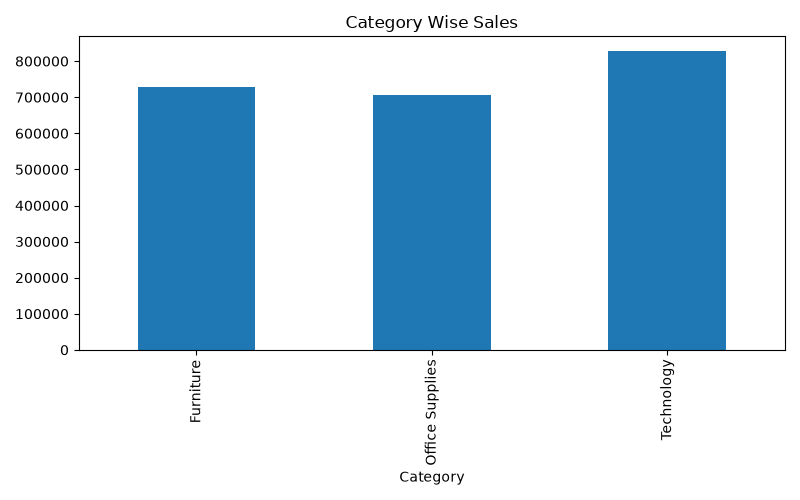
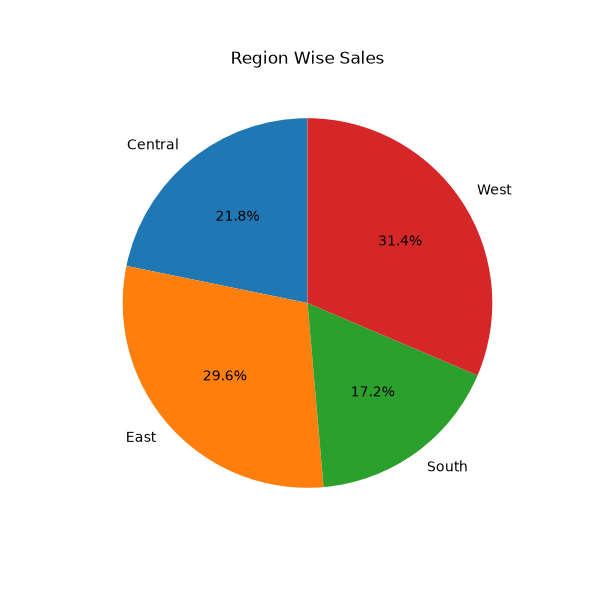
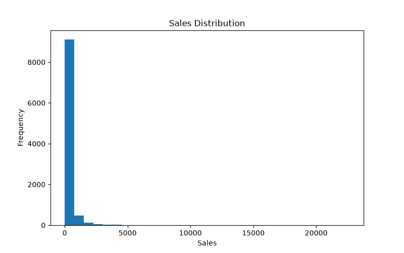

# 📊 Sales Data Analysis using Python

A complete Sales Data Analysis project using Python, Pandas and Matplotlib with the Superstore Sales Dataset.

---

## 📌 Project Overview

This project analyzes Superstore sales data to understand business performance.

The analysis includes:

- Data Cleaning
- Missing Value Analysis
- Total Sales Calculation
- Average Sales Calculation
- Top 10 Best Selling Products
- Category Wise Sales
- Region Wise Sales
- Sales Distribution Visualization

---

## 📂 Dataset

Dataset Used:

- Superstore Sales Dataset
- File: `Dataset/train.csv`

Total Records:
- 9800 rows
- 18 columns

---

## 🛠 Tools Used

- Python
- VS Code
- Git
- GitHub

---

## 📚 Python Libraries

- Pandas
- Matplotlib

---

## ✨ Features

✔ Data Inspection

✔ Missing Value Detection

✔ Statistical Summary

✔ Total Sales

✔ Average Sales

✔ Top 10 Products

✔ Category Wise Sales

✔ Region Wise Sales

✔ Sales Distribution

✔ Automatic Chart Saving

---

## 📈 Charts Generated

The project automatically generates:

- Category Wise Sales (Bar Chart)
- Region Wise Sales (Pie Chart)
- Sales Distribution (Histogram)

All charts are saved inside the **Images** folder.

---

## 📁 Project Structure

```
Sales-Data-Analysis/
│
├── Dataset/
│   └── train.csv
│
├── Python/
│   └── sales_analysis.py
│
├── Images/
│   ├── category_sales.png
│   ├── region_sales.png
│   └── sales_distribution.png
│
├── Excel/
├── SQL/
├── PowerBI/
│
└── README.md
```

---

## ▶ How to Run

Clone the repository

```bash
git clone https://github.com/SHANKU03/Sales-Data-Analysis.git
```

Install dependencies

```bash
pip install pandas matplotlib
```

Run the project

```bash
python Python/sales_analysis.py
```

---
## 📸 Project Output

### Category Wise Sales



### Region Wise Sales



### Sales Distribution



## 🚀 Future Improvements

- Interactive Dashboard
- Power BI Dashboard
- SQL Analysis
- Excel Dashboard
- Seaborn Visualizations
- Plotly Interactive Charts

---

## 👨‍💻 Author

**Souradeep Bhattacharyay**

GitHub:

https://github.com/SHANKU03
